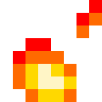
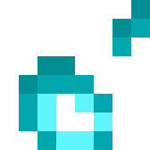

<h1 align="center">
   
  Better Flame Particles
</h1>

  
  
  
  

> A resource pack for Minecraft 1.14x-1.21x

## Features

_Witness mesmerizing animations as the flames dance and the soul flames flicker._

This resource pack changes the flame and soul flame particles to animated versions.

## Preview

  
  

## Installation

Download the latest release from [here](https://github.com/Tschipcraft/better_flame_particles/releases/latest), put the resource pack .zip file into your `resourcepacks` folder and activate it ingame.

Also available on Modrinth and CurseForge.

<a href="https://modrinth.com/resourcepack/better-flame-particles">
<picture>
  <source height="72px" media="(prefers-color-scheme: dark)" srcset="https://raw.githubusercontent.com/Tschipcraft/badges/main/assets/modrinth-badge-dark.svg">
  <source height="72px" media="(prefers-color-scheme: light)" srcset="https://raw.githubusercontent.com/Tschipcraft/badges/main/assets/modrinth-badge-light.svg">
  
</picture>
</a>
<a href="https://www.curseforge.com/minecraft/texture-packs/better-flame-particles">
<picture>
  <source height="72px" media="(prefers-color-scheme: dark)" srcset="https://raw.githubusercontent.com/Tschipcraft/badges/main/assets/curseforge-badge-dark.svg">
  <source height="72px" media="(prefers-color-scheme: light)" srcset="https://raw.githubusercontent.com/Tschipcraft/badges/main/assets/curseforge-badge-light.svg">
  
</a>

## Compatibility

This pack overrides the flame particles. Non-vanilla-style resource packs will look out of place with it.
